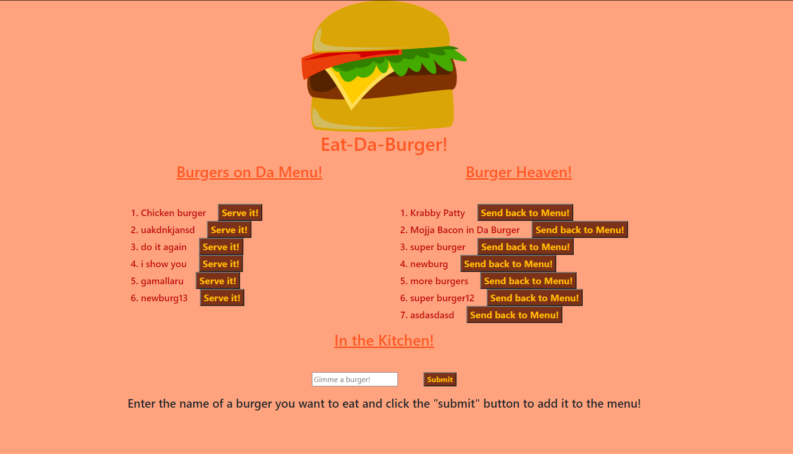

# Eat-Da-Burger
 

## Description & Deployment
This app allows a user to enter the name of a burger they want to eat and add it to a menu. When the user is ready to serve the burger, it will move off the menu and into the Burger Heaven.
[VIEW THE DEPLOYED APP HERE](./public/assets/img/app-img.PNG)

---

## Table of Contents
1. [Installation](#Installation)
2. [Usage](#Usage)
3. [License](#license)
4. [Contributing](#Contributing)
5. [Questions](#Questions)
---

## Installation
1. Install mysql and express, and express-handlebars

## Usage
After installing all the packages, the user can run
 ~~~JS 
 npm start 
 ~~~ 
 in the command line, open the browser to localhost with port 8080, and enter the burger they wish to eat and click the "serve" or "send back to menu" button.

---

## License
### ISC License
Copyright (c) 2020 Brianna Bullock

Permission to use, copy, modify, and/or distribute this software for any purpose with or without fee is hereby granted, provided that the above copyright notice and this permission notice appear in all copies.

THE SOFTWARE IS PROVIDED "AS IS" AND THE AUTHOR DISCLAIMS ALL WARRANTIES WITH REGARD TO THIS SOFTWARE INCLUDING ALL IMPLIED WARRANTIES OF MERCHANTABILITY AND FITNESS. IN NO EVENT SHALL THE AUTHOR BE LIABLE FOR ANY SPECIAL, DIRECT, INDIRECT, OR CONSEQUENTIAL DAMAGES OR ANY DAMAGES WHATSOEVER RESULTING FROM LOSS OF USE, DATA OR PROFITS, WHETHER IN AN ACTION OF CONTRACT, NEGLIGENCE OR OTHER TORTIOUS ACTION, ARISING OUT OF OR IN CONNECTION WITH THE USE OR PERFORMANCE OF THIS SOFTWARE. 

---
## Contributing
If a developer wishes to contribute, please send Brianna an email at the email link below.

## Questions

You can visit my [Github Profile](https://www.github.com/kairora) or [this app's Github repo](https://github.com/kairora/burger) to learn more about this CLI.
Or, if you have questions regarding this CLI program, please [send me an email](mailto:brianna.bullock16@gmail.com). 